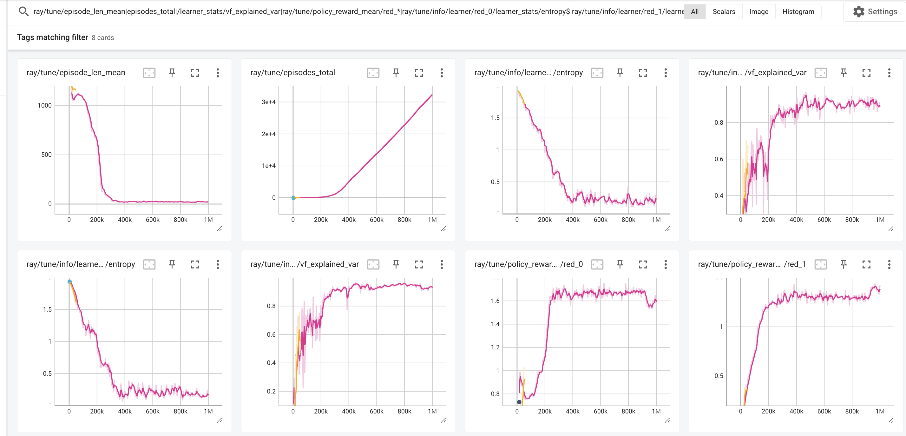
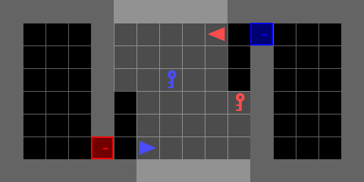

## Task 1
code updated

## Task 2
- Reflection question - i trained from scratch with randomization turned on.  it worked fine as far as i could tell

## Task 3
- Params worked okay without modifiction
- I attemped to turn red into an evil killer by raising it's elimination reward, but didn't observe a change
- 

